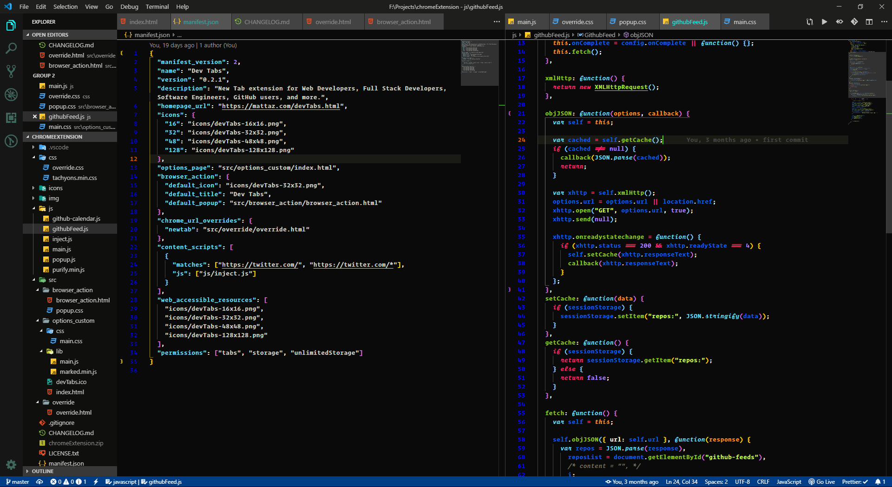
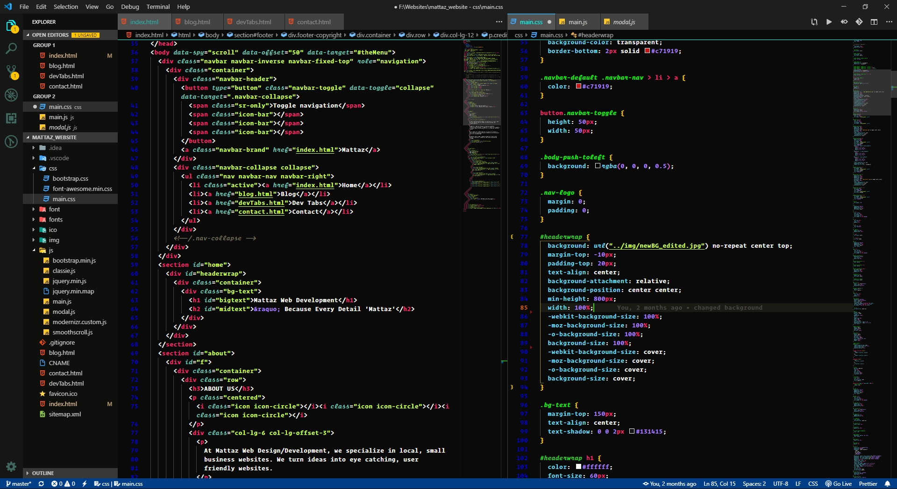

# README

## This is the README for "dark-cipher" - A Dark Theme for VS Code

### This theme is based on the [Blakai theme](https://vscodethemes.com/e/asilverio.blackai-visual-studio-code), A blacked Monokai based theme for Visual Studio Code.

A lot of the colors have been altered. ex:

- The Activity Bar
- Activity bar badges
- The status bar has been changed to blue
- Small thin line added at the top to separate the editor
- Line numbers - Blue / Active Line numbers - Orange

I have also added some different italics for:

- JavaScript
- TypeScript
- Go
- Ruby

### For more information

- [Dark-Cipher Theme](https://github.com/Cipher-Coder/dark-cipher)
- [Blakai Theme](https://vscodethemes.com/e/asilverio.blackai-visual-studio-code)

Some Screenshots

_JSON / JavaScript Screenshot_

&nbsp;

_HTML / CSS Screenshot_

&nbsp;

## How to use:

- Clone or download the Repository
- Go to your extensions folder in the .vscode directory - in Windows it is in `C:\Users\YourName\.vscode\extensions` and on Linux the directory is in `~/home/.vscode/extensions`
- Place a copy of the entire folder in the extensions directory
- Open VS Code and go to 'Settings' then select 'color theme' and select 'dark-cipher'

**Enjoy!**
